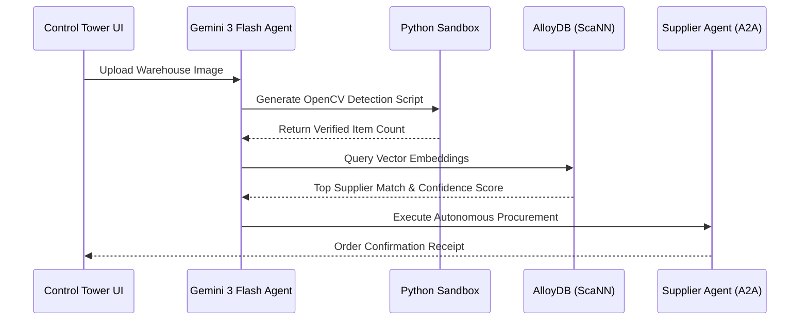

# 🏭 Autonomous Multimodal Procurement Agent (AMPA)

An enterprise-grade, agentic supply chain control tower that bridges the gap between physical inventory and digital procurement. 

Powered by **Gemini 3 Flash** and **Google Cloud AlloyDB**, this system demonstrates a complete autonomous loop: interpreting visual real-world data, writing and executing code to verify it, retrieving high-dimensional supplier vectors, and executing orders via an Agent-to-Agent (A2A) protocol.


##  The Agentic Workflow

This system abandons static scripts in favor of a dynamic, reasoning-based AI architecture:

1. ** Perception (Visual Reasoning):** The agent ingests warehouse imagery. Instead of relying on standard OCR, it leverages Gemini 3 Flash to generate and execute **Python OpenCV** scripts on the fly to accurately detect and count physical inventory. 


2. ** Memory (Vector Search):** Visual data is transformed into embeddings and queried against a massive supplier database. Using **AlloyDB AI** and **ScaNN** (Scalable Nearest Neighbors), the system performs sub-millisecond similarity matching. 

3. ** Action (A2A Protocol):** Once a high-confidence supplier match is found, the system autonomously negotiates and places the order using the **Agent-to-Agent (A2A) Protocol**, requiring zero human intervention.
 


## 📊 System Architecture



# 🚀 Technical Stack
1. **Core AI:** Google Gemini 3 Flash (Multimodal Reasoning & Code Execution)

2. **Vector Database:** Google Cloud AlloyDB for PostgreSQL (pgvector + ScaNN)

3. **Frontend:** Alpine.js, Tailwind CSS (Reactive, lightweight UI)

4. **Backend Integration:** Python, WebSockets for live "Thought Stream" streaming

5. **Infrastructure:** Google Cloud Platform (Vertex AI, Cloud Run ready)

# 🎯 Business Impact & Use Cases
1. Eliminated Manual Verification: Transitions inventory auditing from a manual, error-prone human task to a mathematically verified, code-backed automated process.

2. Instant Vendor Matching: Reduces the time spent cross-referencing visual parts with vendor catalogs from hours to milliseconds.

3. Frictionless Scaling: The A2A protocol design allows the system to scale infinitely without requiring additional procurement headcount.

# ⚙️ Quick Start Setup
Prerequisites
Google Cloud Project with Vertex AI and AlloyDB APIs enabled.

Application Default Credentials (ADC) configured locally.

Installation
```Bash
# 1. Clone the repository
git clone [https://github.com/PavanKS17/Agentic-Multimodal-Visual-Procurement-System.git](https://github.com/PavanKS17/Agentic-Multimodal-Visual-Procurement-System.git)
cd Agentic-Multimodal-Visual-Procurement-System

# 2. Install Python dependencies
pip install -r requirements.txt

# 3. Authenticate with Google Cloud
gcloud auth application-default login --no-launch-browser
gcloud auth application-default set-quota-project YOUR_PROJECT_ID
```
